# 1-3 유스케이스 명세서

## 1. 개요

- 본 문서는 Beach-Saver 프로젝트의 주요 기능별 유스케이스를 정의하여, 관련된 액터(Actor), 각 유스케이스의 목적, 기본 흐름, 예외 흐름, 사전/사후 조건 등을 명확히 기술합니다.
- 모든 유스케이스는 실제 운영 시나리오를 기반으로 작성되며, 개발팀과 테스트팀이 시스템의 기능적 요구사항을 이해하고 구현 및 검증하는 데 직접 활용될 수 있도록 합니다.
- 본 문서에 기술된 유스케이스는 최상위 **"Beach-Saver 문서화 개요" (README.md)** 및 **"1-1 프로젝트 개요"**에 정의된 다음의 핵심 정책 및 구조를 전제로 합니다:
  - **사용자 역할 및 계층 구조:** PlatformAdmin, CityAdmin, DistrictAdmin, 작업자(조사자, 청소자, 수거자), 시민(자원봉사자)으로 정의된 역할 및 그에 따른 권한.
  - **계정 정책:** 역할별 계정 분리, 관리자 주도 작업자 계정 생성(단일/엑셀), 시민 자가 가입 및 승인 절차, ID 자동 생성 규칙, 휴대폰 번호 기반 로그인 정책 등.
  - **핵심 업무 흐름:** 조사 → 청소(팀 단위) → **수거용 보고서(청소자 작성)** → 수거 완료(수거자 처리)로 이어지는 프로세스.
  - **팀 단위 처리 정책:** 팀 구성, 팀장/팀원 역할 및 책임, 공식 보고 절차, 실적/보상 분배 등.
  - **알림(Notifications) 정책:** 주요 이벤트 발생 시 역할별/채널별 알림 발송.
  - **기타 주요 정책:** PWA 미도입, Native 앱(작업자)/웹(관리자) 분리, 오프라인 지원 등.
- 각 유스케이스의 상세 설명 시, 관련된 특정 정책이 있다면 해당 정책을 직접 참조하거나 그 영향을 명시합니다.

---

## 2. 주요 액터(Actors) 정의

본 유스케이스 명세서에서 사용되는 주요 액터는 다음과 같으며, 각 액터의 상세 역할 및 권한은 "Beach-Saver 문서화 개요"의 "사용자 역할 및 권한 체계" 표를 따릅니다.

- **PlatformAdmin (플랫폼 운영사):** 시스템 전체 관리 및 정책 설정.
- **CityAdmin (시청 관리자):** 관할 시 전체의 운영 관리, 시민 계정 승인 등.
- **DistrictAdmin (구청 관리자):** 관할 구의 작업자 관리, 업무 배정, 실적 관리 등.
- **조사자 (Worker - Investigator):** 현장 쓰레기 상황 조사 및 보고서 작성.
- **청소자 (Worker - Cleaner):** 현장 청소 작업 수행 및 청소 보고서/수거용 보고서 작성 (정규 작업자 또는 승인된 시민).
- **수거자 (Worker - Collector):** 집하된 쓰레기 수거 및 수거 완료 처리.
- **시민 (Citizen - 자원봉사자):** 자가 회원가입, 정화 활동 참여 (승인 후 청소자 역할).
- **시스템 (System):** Beach-Saver 백엔드 및 프론트엔드 시스템 전체.

---

## 3. 유스케이스 다이어그램

### 3-1. 전체 시스템 주요 유스케이스 다이어그램 (예시)

```mermaid
graph TD
    subgraph "관리자 시스템 (웹)"
        A1[PlatformAdmin]
        A2[CityAdmin]
        A3[DistrictAdmin]
    end

    subgraph "작업자 시스템 (모바일 앱)"
        W1[조사자]
        W2[청소자]
        W3[수거자]
        C1[시민]
    end

    UC_ACC_MGMT("UC-SYS-01: 계정 및 권한 관리")
    UC_CITIZEN_APPROVAL("UC_CITIZEN_01: 시민 가입 및 승인")
    UC_TEAM_MGMT("UC_TEAM_01: 팀 구성 및 관리")
    UC_WORK_ASSIGN("UC_ADMIN_01: 작업 배정")
    UC_REPORT_INV("UC_WORKER_01: 조사 보고서 관리")
    UC_REPORT_CLN("UC_WORKER_02: 청소 보고서 관리")
    UC_REPORT_COL_REQ("UC_WORKER_03: 수거용 보고서 관리 (청소자 작성)")
    UC_REPORT_COL_FIN("UC_WORKER_04: 수거 완료 처리 (수거자)")
    UC_STATS("UC_ADMIN_02: 통계 및 대시보드 조회")
    UC_NOTIFICATION("UC_SYS_02: 알림 수신 및 관리")
    UC_LOGIN("UC_COMMON_01: 로그인")
    UC_AI_PREDICT("UC_ADMIN_03: AI 예측 결과 조회")

    A1 --- UC_ACC_MGMT
    A2 --- UC_ACC_MGMT
    A3 --- UC_ACC_MGMT
    A2 --- UC_CITIZEN_APPROVAL
    C1 -- 자가 가입 --> UC_CITIZEN_APPROVAL
    A3 --- UC_TEAM_MGMT
    A3 --- UC_WORK_ASSIGN

    W1 --- UC_LOGIN
    W2 --- UC_LOGIN
    W3 --- UC_LOGIN
    C1 --- UC_LOGIN

    W1 --- UC_REPORT_INV
    W2 --- UC_REPORT_CLN
    W2 --- UC_REPORT_COL_REQ
    W3 --- UC_REPORT_COL_FIN

    A1 --- UC_STATS
    A2 --- UC_STATS
    A3 --- UC_STATS

    A1 --- UC_NOTIFICATION
    A2 --- UC_NOTIFICATION
    A3 --- UC_NOTIFICATION
    W1 --- UC_NOTIFICATION
    W2 --- UC_NOTIFICATION
    W3 --- UC_NOTIFICATION
    C1 --- UC_NOTIFICATION

    A1 --- UC_AI_PREDICT
    A2 --- UC_AI_PREDICT
    A3 --- UC_AI_PREDICT

    %% 추가적인 include, extend 관계는 상세 유스케이스에서 표현 가능
```



> **설명:** 위 다이어그램은 주요 액터와 핵심 유스케이스 간의 관계를 개략적으로 보여줍니다. 각 유스케이스는 아래 표와 상세 시나리오에서 구체화됩니다.

### 3-2. 조직 위계(Authority Structure) 및 시민 참여 업무 프로세스 다이어그램

> **참고:** 조직 위계 및 시민 참여 업무 프로세스의 상세 흐름은 "Beach-Saver 문서화 개요" (README.md)의 섹션 4-1 및 4-2 다이어그램을 참조하십시오. (해당 문서에서 이미 상세히 기술됨)

---

## 4. 유스케이스 표

| ID                   | 유스케이스명                             | 주요 액터                                 | 개요/목적                                                                                                                                 | 관련 기능요구사항(FR)             | 비고/핵심 정책 참조                                                           |
| -------------------- | ---------------------------------------- | ----------------------------------------- | ----------------------------------------------------------------------------------------------------------------------------------------- | --------------------------------- | ----------------------------------------------------------------------------- |
| UC-SYS-01            | 계정 및 권한 관리                        | PlatformAdmin, CityAdmin, DistrictAdmin   | 역할별 사용자 계정(작업자, 관리자)을 생성, 수정, 삭제하고 권한을 관리하며, 모든 이력을 기록한다.                                          | FR-1, FR-3, FR-12, FR-15          | 계정 정책 (ID 자동생성, 별도 계정 원칙), 조직/권한 구조. 엑셀 대량 등록 지원. |
| UC-SYS-02            | 알림 수신 및 관리                        | 모든 사용자 (역할별 차등)                 | 시스템에서 발생하는 주요 이벤트(업무 배정, 보고서 상태 변경, 계정 승인 등)에 대한 알림을 수신하고 설정을 관리한다.                        | FR-16                             | 알림 정책 (채널, 구독, 이력).                                                 |
| UC-COMMON-01         | 로그인                                   | 모든 사용자                               | 휴대폰 번호와 인증번호를 통해 시스템에 안전하게 로그인한다. 동일 번호 다중 역할 시 역할을 선택하여 로그인한다.                            | FR-1                              | 로그인 정책 (ID 직접 입력 예외 허용), 접근성.                                 |
| UC_CITIZEN_01        | 시민(자원봉사자) 가입 및 승인            | 시민, CityAdmin                           | 시민이 자가 회원가입을 신청하고, CityAdmin이 이를 검토하여 승인 후 '청소자' 역할로 전환한다.                                              | FR-2                              | 시민 관리 주체 정책, 계정 정책 (임시 계정, 승인 전 제한).                     |
| UC_TEAM_01           | 팀 구성 및 관리                          | DistrictAdmin, 팀장(작업자), 팀원(작업자) | DistrictAdmin 또는 팀장이 청소/수거 업무를 위한 팀을 구성/변경/해체하고, 팀원은 팀 활동에 참여한다.                                       | FR-4                              | 팀 단위 처리 정책 (팀장/팀원 역할, 실적/보상 분배).                           |
| UC_ADMIN_01          | 작업 배정 및 관리                        | DistrictAdmin                             | 관할 작업자(조사자/청소자/수거자/시민 청소자)에게 업무를 배정하고 진행 상황을 관리한다.                                                   | FR-3, FR-5                        | 업무 배정 정책 (자동화 원칙, 조사 결과 기반 배정).                            |
| UC_ADMIN_02          | 통계 조회 및 보고서 다운로드             | PlatformAdmin, CityAdmin, DistrictAdmin   | 역할별 권한에 따라 담당 지역/조직의 해양 쓰레기 관련 통계(수거량, 분포 등)를 대시보드/지도로 조회하고, 데이터를 엑셀 파일로 다운로드한다. | FR-11, FR-12, FR-13               | 대용량 데이터 처리, 지도 렌더링 성능.                                         |
| UC_ADMIN_03          | AI 예측 결과 조회 및 활용                | PlatformAdmin, CityAdmin, DistrictAdmin   | 시스템이 제공하는 AI 기반 쓰레기 발생 예측, 자원 배치 제안 등의 결과를 조회하고 운영에 활용한다.                                          | FR-19                             |                                                                               |
| UC_WORKER_01         | 조사 보고서 작성 및 제출                 | 조사자                                    | 현장 조사 후, GPS/사진 등 현장 데이터를 포함한 조사 보고서를 작성하고 시스템에 제출한다. (집하장 정보 X)                                  | FR-6, FR-10                       | 오프라인 지원, 중복 보고 방지(Claim 정책).                                    |
| UC_WORKER_02         | 청소 보고서 작성 및 제출 (팀 단위)       | 청소자 (팀장/팀원)                        | 배정된 업무에 따라 팀 단위로 청소 작업을 수행하고, 팀장이 취합하여 청소 보고서를 작성/제출한다. (집하장 정보 X)                           | FR-4, FR-7, FR-10                 | 팀 단위 처리 정책, 오프라인 지원.                                             |
| UC_WORKER_03         | **수거용 보고서** 작성 및 제출 (청소자)  | 청소자                                    | 청소 작업 완료 후, 쓰레기를 모아둔 집하장(들)의 위치, 사진, 설명 등을 포함한 **수거용 보고서**를 별도로 작성하여 시스템에 제출한다.       | FR-8, FR-10                       | 전체 업무 흐름 (조사→청소→수거용 보고서→수거), 오프라인 지원.                 |
| UC_WORKER_04         | **수거 완료** 처리 (수거자)              | 수거자                                    | 청소자가 제출한 '수거용 보고서'를 기반으로 집하장의 쓰레기를 수거하고, 각 집하장별로 '수거 완료' 처리를 한다.                             | FR-9, FR-10                       | 전체 업무 흐름, 수거자 차량/업체 검증 정책, 오프라인 지원.                    |
| UC_WORKER_05         | 나의 실적/정산 확인 (작업자)             | 조사자, 청소자, 수거자, 시민(청소자 역할) | 모바일 앱 내에서 본인의 누적 활동 실적, 예상 보상 또는 정산 내역 등을 확인한다.                                                           | (FR-9, FR-12에 포함 또는 신규 FR) | 실적/정산 연동 정책.                                                          |
| UC_ACC_01            | 정보취약계층 접근성 기능 사용            | 모든 사용자 (특히 작업자)                 | 시스템 사용 시 큰글씨/고대비 모드 등 접근성 기능을 토글하여 사용 편의성을 높인다.                                                         | FR-14, NFR-3                      |                                                                               |
| UC_SYS_DEV_01        | API 문서 자동 생성 및 조회 (개발/운영팀) | 개발팀, 운영팀 (시스템 액터 간주 가능)    | 시스템 빌드 시 API 명세(Swagger/RestDocs)가 자동으로 생성/배포되어 개발 및 연동에 활용된다.                                               | FR-17                             | N/A (개발 프로세스 관련)                                                      |
| UC_ADMIN_REPORT_01   | PDF 보고서 생성 및 발송 (관리자)         | PlatformAdmin, CityAdmin, DistrictAdmin   | 시스템 내 주요 통계/분석 보고서를 PDF 형태로 자동 생성하거나, 특정 조건으로 생성하여 지정된 수신자에게 이메일로 발송한다.                 | FR-20                             |                                                                               |
| UC_ADMIN_AI_PHOTO_01 | AI 사진 분류 결과 확인 (관리자)          | PlatformAdmin, CityAdmin, DistrictAdmin   | 작업자가 제출한 현장 사진에 대해 AI가 자동 분류(쓰레기 종류, 환경 등)하고 품질 점수를 매긴 결과를 확인하고 업무에 활용한다.               | FR-21                             |                                                                               |

> 참고: 위 유스케이스 표의 '관련 기능요구사항(FR)' ID는 이전 "1-4 기능명세" 문서의 최신 버전을 기준으로 매칭하였습니다. ID가 변경되었을 경우 해당 문서 기준으로 업데이트 필요

---

## 5. 주요 유스케이스 상세 명세

### 5.1. UC_WORKER_01: 조사 보고서 작성 및 제출 (액터: 조사자)

- **개요:** 조사자는 담당 해안의 쓰레기 현황을 파악하고, 관련 정보를 모바일 앱을 통해 시스템에 보고한다. 이 보고서는 후속 청소 및 수거 작업의 기초 자료로 활용된다.
- **관련 기능 요구사항:** FR-6 (조사 보고서), FR-10 (GPS/사진 자동 기록), FR-18 (중복 보고 방지)
- **사전 조건:**
  1. 조사자는 유효한 '조사자' 역할의 계정으로 모바일 앱에 로그인되어 있다. (UC-COMMON-01)
  2. 조사자에게는 DistrictAdmin에 의해 하나 이상의 조사 대상 해안 또는 구역이 배정되어 있다. (UC_ADMIN_01)
  3. 모바일 기기의 GPS 및 카메라 기능이 활성화되어 있다.
  4. (선택적) 오프라인 작업 지원을 위해 관련 데이터(해안 목록 등)가 앱 내에 동기화되어 있다. (NFR-9)
- **기본 흐름 (Successful Path):**

  ```mermaid
  sequenceDiagram
      participant I as 조사자
      participant App as 모바일 앱
      participant Sys as 시스템(서버)

      I->>App: '조사 보고서 작성' 선택
      App->>Sys: (필요시) 최신 해안 목록/배정 작업 요청
      Sys-->>App: 해안 목록/배정 작업 정보 응답
      App-->>I: 조사 대상 해안 선택 화면 표시
      I->>App: 조사 대상 해안 선택
      App-->>I: 보고서 입력 양식 표시 (해안명 자동 입력)
      I->>App: 조사 시작 위치에서 '조사 시작' 기록
      App->>Sys: 조사 시작 정보(위치, 시간) 임시 저장/전송 (FR-10)
      I->>App: 현장 쓰레기 정보 입력 (종류, 양, 사진 첨부 등)
      App->>Sys: 입력 데이터 실시간/주기적 임시 저장 (FR-10)
      I->>App: 조사 종료 위치에서 '조사 완료' 기록
      App->>Sys: 조사 종료 정보(위치, 시간), 최종 보고서 내용 전송 (FR-10)
      Sys->>Sys: 데이터 유효성 검증, 중복 보고 여부 확인 (FR-18)
      Sys-->>App: 보고서 제출 결과 (성공/실패) 응답
      App-->>I: 제출 완료 또는 오류 메시지 표시
      alt 성공 시
          Sys-->>DistrictAdmin: (알림) 신규 조사 보고서 제출 (FR-16)
      end
  ```

  1. 조사자는 앱에서 '조사 보고서 작성' 메뉴를 선택한다.
  2. 시스템은 조사자에게 배정된 조사 대상 해안 목록을 보여준다.
  3. 조사자는 조사할 해안을 선택한다.
  4. 조사자는 '조사 시작'을 선택하고, 시스템은 자동으로 현재 위치(GPS)와 시간을 기록한다. (FR-10)
  5. 조사자는 해안을 따라 이동하며 발견된 쓰레기의 종류, 양, 상태 등을 입력하고 사진을 촬영하여 첨부한다.
  6. 조사자는 '조사 종료'를 선택하고, 시스템은 자동으로 현재 위치(GPS)와 시간을 기록하며, 시작점과 종료점 간의 거리를 기반으로 조사 해안 길이를 계산할 수 있다. (FR-10)
  7. 조사자는 추가적인 특이사항이나 의견을 입력한 후 '보고서 제출'을 선택한다.
  8. 시스템은 중복 보고 여부를 확인하고(Claim 정책, FR-18), 데이터 유효성을 검증한다.
  9. 시스템은 조사 보고서를 저장하고, 조사자에게 제출 완료 알림을 표시한다.
  10. 시스템은 해당 DistrictAdmin에게 새로운 조사 보고서가 제출되었음을 알린다. (FR-16)

- **예외 흐름 (Exceptional Paths):**
  - **4a. GPS 수신 실패:** 시스템은 GPS 수신 실패를 알리고, 수동 위치 입력을 안내하거나 오차 범위 내 최근 위치 사용 여부를 확인한다.
  - **5a. 사진 업로드 실패:** 시스템은 사진 업로드 실패를 알리고, 재시도 또는 임시 저장 후 나중에 업로드할 수 있도록 안내한다. (오프라인 지원, NFR-9)
  - **8a. 중복 보고 감지:** 시스템은 이미 해당 구역/시간에 유사한 보고가 있음을 알리고, 추가 정보로 제출할지 또는 취소할지 선택하도록 한다.
  - **9a. 서버 저장 실패 (네트워크 오류 등):** 시스템은 보고서를 기기 내에 안전하게 임시 저장하고, 네트워크 연결 시 자동 또는 수동으로 동기화/제출할 수 있도록 안내한다. (NFR-9)
- **사후 조건:**
  1. 조사 보고서가 시스템에 성공적으로 저장되고 고유 ID가 부여된다.
  2. DistrictAdmin은 새로운 조사 보고서를 확인하고 후속 조치(청소 작업 배정 등)를 취할 수 있다.
  3. 조사자는 본인이 제출한 보고서 목록 및 상태를 확인할 수 있다.
- **관련 정책 및 참고:**
  - 조사자는 집하장 정보를 입력하지 않는다 (전체 업무 흐름 정책).
  - 오프라인 작업이 지원되어야 한다 (NFR-9).
  - Claim 정책에 따라 중복 보고가 관리된다 (FR-18).

### 5.2. UC_WORKER_02: 청소 보고서 작성 및 제출 (팀 단위) (액터: 청소자 (주로 팀장))

- **개요:** 청소팀(팀장 및 팀원)은 배정된 조사 보고서 또는 구역에 따라 청소 작업을 수행하고, 팀장은 팀원들의 기여를 포함한 청소 보고서를 시스템에 제출한다. 이 보고서는 청소 실적 관리 및 후속 수거 작업의 연계(수거용 보고서)를 위해 사용된다.
- **관련 기능 요구사항:** FR-4 (팀 단위 처리), FR-7 (청소 보고서), FR-10 (GPS/사진 자동 기록)
- **사전 조건:**
  1. 팀장 및 팀원은 유효한 '청소자' 역할의 계정으로 모바일 앱에 로그인되어 있다. (UC-COMMON-01)
  2. DistrictAdmin에 의해 청소팀에게 특정 조사 보고서 또는 구역에 대한 청소 업무가 배정되어 있다. (UC_ADMIN_01, UC_TEAM_01)
  3. 팀 구성(팀장, 팀원)이 시스템에 정의되어 있다. (UC_TEAM_01)
- **기본 흐름 (Successful Path):**

  ```mermaid
  sequenceDiagram
      participant TM as 팀장 (청소자)
      participant TMs as 팀원 (청소자)
      participant App as 모바일 앱
      participant Sys as 시스템(서버)

      TM->>App: '청소 보고서 작성' 선택 (배정된 업무 기반)
      App-->>TM: 팀 청소 보고서 양식 표시
      TMs->>App: (각자) 청소 중 현장 사진/작업 내용 등 자료 첨부
      App->>Sys: 팀원별 기여 자료 실시간/주기적 동기화 및 임시 저장
      TM->>App: 팀원들 자료 취합 확인 및 최종 보고서 내용 정리
      TM->>App: '청소 보고서 최종 확정/제출' 선택
      Sys->>Sys: 데이터 유효성 검증
      Sys-->>App: 보고서 제출 결과 (성공/실패) 응답
      App-->>TM: 제출 완료 또는 오류 메시지 표시
      alt 성공 시
          Sys-->>DistrictAdmin: (알림) 신규 청소 보고서 제출 (FR-16)
          TM->>App: (이어서) '수거용 보고서 작성' 선택 (UC_WORKER_03)
      end
  ```

  1. 팀장은 앱에서 배정된 청소 업무를 선택하고 '청소 보고서 작성'을 시작한다. 시스템은 팀 단위 보고서임을 인지한다.
  2. 팀장 및 각 팀원은 청소 작업을 진행하며, 각자 담당한 구역의 청소 전/후 사진, 수거한 쓰레기 종류/양(개략적), 작업 내용 등을 앱을 통해 해당 팀 청소 보고서에 실시간으로 첨부/기록한다. (FR-10)
  3. 시스템은 팀원들의 기여 데이터를 실시간으로 동기화하거나 주기적으로 임시 저장한다.
  4. 모든 팀원의 작업이 완료되면, 팀장은 앱에서 팀원들이 제출한 모든 자료를 검토하고 취합하여 최종 청소 보고서를 작성한다. (팀장의 공식 보고/완료 처리 원칙, FR-4)
  5. 팀장은 '청소 보고서 최종 확정/제출'을 선택한다.
  6. 시스템은 데이터 유효성을 검증한다.
  7. 시스템은 청소 보고서를 저장하고, 팀장에게 제출 완료 알림을 표시한다.
  8. 시스템은 해당 DistrictAdmin에게 새로운 청소 보고서가 제출되었음을 알린다. (FR-16)
  9. 팀장은 이어서 "수거용 보고서"를 작성한다. (UC_WORKER_03)

- **예외 흐름 (Exceptional Paths):**
  - **2a. GPS/사진 자동 기록 실패:** 각 팀원은 오류 알림을 받고 수동 입력 또는 재시도 옵션을 안내받는다.
  - **3a. 팀원 데이터 동기화 실패:** 오프라인 저장 후 온라인 시 재동기화 시도. (NFR-9)
  - **6a. 유효성 검증 실패:** 팀장은 오류 메시지와 함께 수정이 필요한 부분을 안내받는다.
  - **7a. 서버 저장 실패:** 팀장은 보고서를 기기 내 임시 저장하고 재시도 안내를 받는다. (NFR-9)
- **사후 조건:**
  1. 팀 단위 청소 보고서가 시스템에 성공적으로 저장되고 고유 ID가 부여된다.
  2. 청소 실적이 팀 및 개인별로 잠정 기록된다 (추후 관리자 검토/확정).
  3. DistrictAdmin은 제출된 청소 보고서를 확인하고, 청소자는 이어서 수거용 보고서를 작성할 수 있다.
- **관련 정책 및 참고:**
  - 팀 단위 처리 정책 (팀장/팀원 역할, 보고 절차, 실적 분배 등) 적용 (FR-4).
  - 청소 보고서에는 집하장 정보를 직접 입력하지 않는다 (전체 업무 흐름 정책).
  - 오프라인 작업 지원 (NFR-9).

### 5.2. (기존) UC_WORKER_03: 수거용 보고서 작성 및 제출 (액터: 청소자)

(사용자님이 제공해주신 기존 상세 시나리오는 매우 훌륭하며, 여기서는 ID만 조정하여 그대로 유지합니다. 필요시 다른 유스케이스들과의 일관성을 위해 약간의 용어 조정만 할 수 있습니다.)

- **ID:** UC_WORKER_03 (기존과 동일)
- **개요:** 청소자가 청소 작업을 완료한 후, 쓰레기를 모아둔 집하장(들)의 위치, 사진, 설명 등을 포함한 **수거용 보고서**를 별도로 작성하여 시스템에 제출한다.
- **관련 기능 요구사항:** FR-8 (수거용 보고서), FR-10 (GPS/사진 자동 기록)
- **사전 조건:**
  1. 청소자는 유효한 '청소자' 역할의 계정으로 모바일 앱에 로그인되어 있다.
  2. 청소자는 담당 구역의 청소 작업을 완료했거나, 진행 중 집하장 정보를 기록할 필요가 있다.
  3. (선택적) 해당 청소 작업과 관련된 '청소 보고서'(UC_WORKER_02)가 시스템에 임시 저장 또는 제출되어 있다.
- **기본 흐름 (Successful Path):**

  ```mermaid
  sequenceDiagram
      participant C as 청소자
      participant App as 모바일 앱
      participant Sys as 시스템(서버)

      C->>App: '수거용 보고서 작성' 선택 (또는 청소 보고서 제출 후 자동 연결)
      App-->>C: 수거용 보고서 입력 양식 표시
      loop 각 집하장 정보 입력
          C->>App: '집하장 추가' 선택
          App->>Sys: (필요시) 현재 위치 GPS 요청
          Sys-->>App: GPS 좌표 응답
          App-->>C: 지도에 현재 위치 표시, 수동 조정/입력 가능
          C->>App: 집하장 위치 확정
          C->>App: 집하장 사진 촬영/첨부
          C->>App: 쓰레기 종류/양/특이사항 입력
      end
      C->>App: '수거용 보고서 제출' 선택
      Sys->>Sys: 데이터 유효성 검증
      Sys-->>App: 보고서 제출 결과 (성공/실패) 응답
      App-->>C: 제출 완료 또는 오류 메시지 표시
      alt 성공 시
          Sys-->>DistrictAdmin: (알림) 신규 수거용 보고서 제출 (FR-16)
          Sys-->>수거자(들): (알림) 신규 수거 대상 발생 (FR-16)
      end
  ```

  1. 청소자는 모바일 앱에서 '수거용 보고서 작성' 기능을 선택한다 (또는 청소 보고서 제출 후 연결).
  2. 청소자는 새로운 집하장 정보를 추가하기 위해 '집하장 추가' 버튼을 누른다.
  3. 시스템은 현재 위치를 GPS를 통해 자동으로 가져와 지도에 표시하고, 청소자는 필요시 위치를 미세 조정하거나 수동으로 주소를 입력한다. (FR-10)
  4. 청소자는 해당 집하장에 모아둔 쓰레기의 사진을 촬영하여 첨부한다. (FR-10)
  5. 청소자는 집하된 쓰레기의 예상량, 주요 쓰레기 종류, 특이사항 등을 입력한다.
  6. 청소자는 추가할 집하장이 더 있다면 2~5단계를 반복한다.
  7. 청소자는 모든 집하장 정보 입력 완료 후 '수거용 보고서 제출' 버튼을 누른다.
  8. 시스템은 입력된 정보의 유효성을 검증한다 (필수 항목 누락 등).
  9. 시스템은 '수거용 보고서'를 서버에 저장하고, 청소자에게 제출 완료 알림을 표시한다.
  10. 시스템은 관련 관리자(DistrictAdmin 등) 및 해당 지역 수거자(들)에게 새로운 수거 요청(수거용 보고서)이 등록되었음을 알린다. (FR-16)

- **예외 흐름 (Exceptional Paths):**
  - **3a. 해당 집하장 쓰레기 없음 또는 문제 발생:** 수거자는 특이사항을 기록하고 관리자에게 보고/알림 기능을 사용할 수 있다.
  - **4a. GPS 수신 실패:** 시스템은 오류를 알리고 수동 확인 또는 사진 등으로 대체 증빙하도록 안내한다.
  - **7a. 서버 저장 실패:** 기기 내 임시 저장 후 재시도 안내. (NFR-9)
- **사후 조건:**
  1. '수거용 보고서'가 시스템에 성공적으로 저장되고 고유 ID가 부여된다.
  2. 수거자는 해당 보고서를 기반으로 수거 작업을 진행할 수 있다.
  3. 관련 관리자는 새로운 수거 요청을 인지하고 관리할 수 있다.
- **관련 정책 및 참고:**
  - 전체 업무 흐름: 조사 → 청소 → **수거용 보고서** → 수거 완료.
  - 청소 보고서와 수거용 보고서는 별개로 관리되나 논리적으로 연결될 수 있음 (예: 어떤 청소 활동의 결과로 이 수거용 보고서가 작성되었는지).
  - 오프라인 작업 지원 (NFR-9).

### 5.3. UC_WORKER_04: 수거 완료 처리 (액터: 수거자)

- **개요:** 수거자는 배정받거나 확인한 '수거용 보고서'에 명시된 집하장의 쓰레기를 수거하고, 각 집하장별로 '수거 완료' 처리를 한다.
- **관련 기능 요구사항:** FR-9 (수거 완료 처리), FR-10 (GPS/사진 자동 기록)
- **사전 조건:**
  1. 수거자는 유효한 '수거자' 역할의 계정으로 모바일 앱에 로그인되어 있다. (UC-COMMON-01)
  2. 수거자는 차량 등록 및 검증 등 수거자 자격 요건을 충족한 상태이다. (계정 정책)
  3. 시스템에는 하나 이상의 처리 대기 중인 '수거용 보고서'가 존재하며, 수거자에게 할당되었거나 조회 가능하다. (UC_WORKER_03, UC_ADMIN_01)
- **기본 흐름 (Successful Path):**

  ```mermaid
  sequenceDiagram
      participant Cdr as 수거자
      participant App as 모바일 앱
      participant Sys as 시스템(서버)

      Cdr->>App: '수거 대상 목록' 조회 (수거용 보고서 기반)
      App->>Sys: 수거 대상 목록 요청
      Sys-->>App: 수거 대상 집하장 목록 표시 (지도/리스트)
      App-->>Cdr: 목록 확인
      Cdr->>App: 특정 집하장 선택 및 '수거 시작/도착' 기록 (선택적)
      Cdr->>App: 해당 집하장 쓰레기 수거 완료 후 '수거 완료' 선택
      App-->>Cdr: 수거 완료 정보 입력 화면 (사진, 실제 수거량, 특이사항 등)
      Cdr->>App: 수거 완료 정보 입력 및 사진 첨부
      App->>Sys: 수거 완료 정보(GPS, 시간, 사진, 수거량 등) 전송 (FR-10)
      Sys->>Sys: 데이터 유효성 검증, 수거용 보고서 상태 업데이트
      Sys-->>App: 처리 결과 (성공/실패) 응답
      App-->>Cdr: '수거 완료' 처리 결과 메시지 표시
      alt 성공 시
          Sys-->>DistrictAdmin: (알림) 집하장 수거 완료 (FR-16)
          Sys-->>청소자(해당 수거용 보고서 작성자): (알림) 요청한 집하장 수거 완료 (FR-16)
      end
  ```

  1. 수거자는 앱에서 '수거 대상 목록'(청소자가 제출한 '수거용 보고서' 기반)을 조회한다. 목록은 지도 또는 리스트 형태로 제공될 수 있다.
  2. 수거자는 수거할 집하장을 선택하고, 현장으로 이동하여 쓰레기를 수거한다. (선택적으로 '수거 시작/도착' 버튼으로 상태 기록 가능)
  3. 수거 완료 후, 수거자는 해당 집하장에 대해 '수거 완료' 버튼을 선택한다.
  4. 시스템은 수거 완료 시점의 GPS 위치와 시간을 자동으로 기록한다. (FR-10)
  5. 수거자는 수거된 쓰레기의 실제 양, 처리 방법, 수거 후 현장 사진 등을 입력/첨부한다.
  6. 수거자는 '최종 완료 제출'을 선택한다.
  7. 시스템은 데이터 유효성을 검증하고, 해당 집하장의 상태를 '수거 완료'로 변경하며 관련 정보를 저장한다.
  8. 시스템은 수거자에게 처리 완료 알림을 표시한다.
  9. 시스템은 해당 DistrictAdmin 및 수거용 보고서를 작성한 청소자에게 수거 완료 사실을 알린다. (FR-16)

- **예외 흐름 (Exceptional Paths):**
  - **3a. 해당 집하장 쓰레기 없음 또는 문제 발생:** 수거자는 특이사항을 기록하고 관리자에게 보고/알림 기능을 사용할 수 있다.
  - **4a. GPS 수신 실패:** 시스템은 오류를 알리고 수동 확인 또는 사진 등으로 대체 증빙하도록 안내한다.
  - **7a. 서버 저장 실패:** 기기 내 임시 저장 후 재시도 안내. (NFR-9)
- **사후 조건:**
  1. 선택된 집하장의 수거 완료 상태가 시스템에 기록된다.
  2. 수거 실적이 수거자에게 잠정 기록된다.
  3. 관련 관리자 및 청소자는 수거 완료 상태를 확인할 수 있다.
- **관련 정책 및 참고:**
  - 수거자는 청소자가 작성한 "수거용 보고서"를 기반으로 작업한다 (전체 업무 흐름 정책).
  - 수거자 차량/업체 검증 정책이 선행되어야 한다.
  - 오프라인 작업 지원 (NFR-9).

### 5.4. UC_CITIZEN_01: 시민(자원봉사자) 가입 및 승인 (액터: 시민, CityAdmin)

- **개요:** 일반 시민이 Beach-Saver 시스템에 자원봉사자로 참여하기 위해 회원가입을 신청하고, CityAdmin은 신청 내용을 검토하여 승인 및 역할(청소자)을 부여한다.
- **관련 기능 요구사항:** FR-1 (계정 생성, 인증), FR-2 (시민 승인/역할 전환)
- **사전 조건:**
  1. 시민은 Beach-Saver 모바일 앱 또는 웹사이트(홍보용/안내용)에 접근 가능하다.
  2. CityAdmin은 관리자 시스템에 로그인되어 있다.
- **기본 흐름 (Successful Path):**

  ```mermaid
  sequenceDiagram
      participant C as 시민
      participant AppWeb as 앱/웹(가입)
      participant Sys as 시스템(서버)
      participant CA as CityAdmin

      C->>AppWeb: '자원봉사자 가입' 선택
      AppWeb-->>C: 가입 양식 표시 (닉네임, 연락처 등 PII 최소화)
      C->>AppWeb: 정보 입력 후 '가입 신청'
      AppWeb->>Sys: 가입 정보 전송, '임시 계정' 생성 요청
      Sys->>Sys: ID 자동 생성 (CITIZEN_ 접두어), 임시 계정 저장 (FR-1)
      Sys-->>C: 가입 신청 완료 및 승인 대기 안내
      Sys-->>CA: (알림) 신규 시민 가입 승인 요청 (FR-16)
      CA->>Sys: 관리자 시스템에서 승인 대기 목록 조회
      CA->>Sys: 해당 시민 선택 후 '승인 및 청소자 역할 부여'
      Sys->>Sys: 계정 상태 '정식'으로 변경, 역할 '청소자'로 업데이트 (FR-2)
      Sys-->>C: (알림) 계정 승인 및 청소자 활동 가능 안내 (FR-16)
  ```

  1. 시민은 Beach-Saver 앱 또는 웹사이트에서 '자원봉사자 가입' 메뉴를 선택한다.
  2. 시스템은 가입 양식(닉네임, 연락처 - 휴대폰 번호 등 최소 PII)을 제공한다.
  3. 시민은 정보를 입력하고 개인정보 활용 동의 후 '가입 신청'을 한다.
  4. 시스템은 입력 정보를 바탕으로 `CITIZEN_` 접두어가 포함된 ID를 자동 생성하고, '임시 계정' 상태로 저장한다. (FR-1)
  5. 시스템은 시민에게 가입 신청이 완료되었으며 관리자 승인 대기 중임을 안내한다.
  6. 시스템은 해당 지역 CityAdmin에게 새로운 시민 가입 승인 요청 알림을 보낸다. (FR-16)
  7. CityAdmin은 관리자 시스템에서 승인 대기 중인 시민 목록을 확인하고, 특정 신청 건을 선택하여 검토한다.
  8. CityAdmin은 신청 내용을 확인 후 '승인' 버튼을 누르고, 해당 시민 계정에 '청소자' 역할을 부여한다. (FR-2)
  9. 시스템은 해당 시민 계정의 상태를 '정식'으로 변경하고, 역할을 '청소자'로 업데이트한다. 모든 이력은 기록된다.
  10. 시스템은 시민에게 계정이 최종 승인되었으며, 이제 '청소자'로서 활동(업무 배정 확인 및 참여)이 가능함을 알린다. (FR-16)

- **예외 흐름 (Exceptional Paths):**
  - **3a. 필수 정보 누락/형식 오류:** 시스템은 오류 메시지를 표시하고 수정을 요청한다.
  - **4a. 이미 가입된 연락처:** 시스템은 이미 해당 연락처로 가입된 계정이 있음을 알리고, 로그인 또는 정보 찾기를 안내한다. (중복 가입 방지)
  - **8a. CityAdmin이 가입 신청 '반려':** CityAdmin은 반려 사유를 입력하고, 시스템은 시민에게 가입이 반려되었음을 알린다. 해당 임시 계정은 비활성화 또는 삭제 처리된다.
- **사후 조건:**
  1. (승인 시) 시민 계정이 '정식' 상태 및 '청소자' 역할로 시스템에 등록된다.
  2. (승인 시) 시민은 휴대폰 번호와 인증번호로 로그인하여 '청소자'로서 활동할 수 있다.
  3. 모든 가입 신청, 승인/반려 이력은 시스템에 기록된다.
- **관련 정책 및 참고:**
  - 시민(자원봉사자) 관리 주체 정책 (CityAdmin 승인, DistrictAdmin 배정).
  - 계정 정책 (ID 자동 생성, PII 최소화 및 안전 저장, 승인 전 기능 제한).
  - 시민은 '청소자' 역할 외 다른 작업자(조사자, 수거자) 역할은 부여받을 수 없음.

### 5.5. UC_ADMIN_01: 작업 배정 및 관리 (액터: DistrictAdmin)

- **개요:** DistrictAdmin은 관할 구역 내의 해안 정화 활동을 위해 등록된 작업자(조사자, 청소자(팀/개인), 수거자)에게 업무를 배정하고, 진행 상황을 모니터링하며 관리한다.
- **관련 기능 요구사항:** FR-3 (작업자 관리), FR-5 (정책 기반 자동화)
- **사전 조건:**
  1. DistrictAdmin은 유효한 계정으로 관리자 웹 시스템에 로그인되어 있다. (UC-COMMON-01)
  2. 시스템에는 관리할 작업자(조사자, 청소자, 수거자, 승인된 시민 청소자) 및 팀 정보가 등록되어 있다. (UC-SYS-01, UC_TEAM_01)
  3. (필요시) 조사 보고서(UC_WORKER_01) 또는 정기적인 작업 계획이 시스템에 존재한다.
- **기본 흐름 (Successful Path - 수동 배정 예시):**

  ```mermaid
  sequenceDiagram
      participant DA as DistrictAdmin
      participant Web as 관리자 웹
      participant Sys as 시스템(서버)
      participant Worker as 작업자

      DA->>Web: '작업 배정 관리' 메뉴 선택
      Web->>Sys: 배정 가능 작업 목록/작업자 목록 요청
      Sys-->>Web: 목록 데이터 응답
      Web-->>DA: 작업 생성/배정 화면 표시
      DA->>Web: 신규 작업 정보 입력 (조사/청소/수거, 구역, 일정, 필요 인원 등) 또는 기존 조사결과 선택
      DA->>Web: 해당 작업에 적합한 작업자/팀 선택 (또는 시스템 추천)
      DA->>Web: '작업 배정' 확정
      Web->>Sys: 작업 배정 정보 전송
      Sys->>Sys: 데이터 유효성 검증, 작업 정보 및 배정 상태 저장
      Sys-->>Web: 배정 완료 응답
      Web-->>DA: 배정 완료 메시지 표시
      Sys-->>Worker: (알림) 신규 작업 배정 알림 (FR-16)
  ```

  1. DistrictAdmin은 관리자 시스템에서 '작업 배정' 또는 '업무 관리' 메뉴를 선택한다.
  2. (신규 작업 생성 시) DistrictAdmin은 작업 유형(조사, 청소, 수거), 대상 해안/구역, 작업 예정일, 필요 인원 등의 정보를 입력하여 신규 작업을 생성한다.
  3. (기존 조사 결과 기반 시) DistrictAdmin은 처리 대기 중인 조사 보고서를 선택하여 청소 작업을 생성한다.
  4. DistrictAdmin은 생성된 작업에 배정할 작업자 또는 팀을 검색하거나 시스템의 추천 목록(가용성, 전문성, 위치 기반 등)에서 선택한다.
  5. DistrictAdmin은 최종적으로 작업 내용을 확인하고 '배정 확정' 버튼을 누른다.
  6. 시스템은 작업 정보와 배정된 작업자/팀 정보를 저장하고, 해당 작업의 상태를 '배정됨' 또는 '진행 예정'으로 변경한다.
  7. 시스템은 배정된 작업자/팀에게 새로운 업무가 배정되었음을 알린다. (FR-16)
  8. DistrictAdmin은 배정된 작업들의 진행 상황(보고서 제출 여부, 완료 여부 등)을 대시보드나 목록에서 모니터링한다. (FR-11, FR-12)

- **예외 흐름 (Exceptional Paths):**
  - **4a. 적합한 작업자/팀 부재:** 시스템은 가용 인력 부족을 알리거나, 조건 완화(일정 조정, 구역 분할 등)를 제안한다.
  - **6a. 작업 정보 저장 실패:** 시스템은 오류를 알리고 재시도를 안내한다.
  - **8a. 작업자 업무 거절/미수행:** 작업자는 사유와 함께 업무 거절 의사를 전달할 수 있으며(알림 또는 별도 기능), DistrictAdmin은 이를 확인 후 재배정 또는 다른 조치를 취한다. (이 부분은 별도 유스케이스 또는 정책으로 상세화 필요)
- **사후 조건:**
  1. 새로운 작업이 생성되고 특정 작업자/팀에게 배정된다.
  2. 배정된 작업자/팀은 새로운 업무를 인지하고 작업을 준비/수행할 수 있다.
  3. DistrictAdmin은 배정된 작업의 상태를 추적할 수 있다.
- **관련 정책 및 참고:**
  - 업무 배정 정책 (자동화 우선 원칙, 정규/시민 청소자 우선순위 등).
  - 팀 단위 처리 정책.
  - 조사 결과 기반 청소 업무 배정 정책.

> 참고: (시간 제약 및 내용의 방대함으로 인해, 모든 주요 유스케이스의 상세 시나리오를 한 번에 작성하는 대신, 핵심적인 작업자 흐름(UC_WORKER_01, 02, (기존)03, 04)과 주요 관리자/시민 유스케이스(UC_CITIZEN_01, UC_ADMIN_01)를 중심으로 우선 상세화했습니다. 나머지 유스케이스(UC-SYS-01, UC_ADMIN_02, 03 등)들도 요청하시면 위와 같은 형식으로 구체화해 드릴 수 있습니다.)

---

## 6. 변경 이력

| 버전 | 일자       | 작성자 | 변경 내용                                                                                                                                                   |
| ---- | ---------- | ------ | ----------------------------------------------------------------------------------------------------------------------------------------------------------- |
| v2   | 2024-06-XX | 홍길동 | 최초 작성                                                                                                                                                   |
| v2.1 | 2024-06-XX | 홍길동 | 역할/계정 정책/수거자 조건 등 실무 기준 보완                                                                                                                |
| v2.2 | 2024-06-03 | 홍길동 | "Beach-Saver 문서화 개요" 최신 정책 반영, 액터 정의, 유스케이스 표 확장, 상세 시나리오 추가, 다이어그램 참조 방식 변경.                                     |
| v2.3 | 2024-06-03 | 홍길동 | UC_WORKER_01, 02, 04 및 주요 관리자 유스케이스(UC_CITIZEN_01, UC_ADMIN_01) 상세 시나리오 추가. 유스케이스 표의 FR ID 및 비고 업데이트 (최신 기능명세 기준). |
