# 2-4 도메인 모델

## [적용 가이드 및 작성 원칙]

- **DB 설계서, 유스케이스, 정책 문서와 1:1 매핑**: 모든 도메인 객체의 속성, 상태, 용어, 정책이 실제 DB 및 정책 문서와 완전히 일치해야 함.
- **Enum/공통 코드 정의와 1:1 매핑**: Status, Role, Type 등 모든 Enum 값은 DB 설계서(3-1. Enum/공통 코드 정의)와 정확히 일치시킬 것. 각 도메인 객체의 Enum 필드는 반드시 해당 값 객체/공통 코드와 연결.
- **객체별 상세화**: 각 도메인 객체마다 아래 항목을 반드시 포함할 것.
  - [1] **주요 속성(필드) 표**: DB 컬럼명, 타입, 설명, 비고(매핑 정보 등) 명확히.
  - [2] **주요 행위(메서드/시그니처) 및 비즈니스 규칙**: 파라미터, 반환값, 예외, 상태 전이, 관련 규칙을 구체적으로 기술.
  - [3] **상태/라이프사이클 및 전이 조건**: Enum 값, 상태 전이 조건을 표로 정리.
  - [4] **예외/엣지케이스**: 실제 운영 중 발생 가능한 경계상황, 예외 케이스 명확히 기술.
- **도메인 서비스/리포지토리**: 각 서비스/리포지토리의 주요 메서드(파라미터, 반환값) 명시.
- **유스케이스별 시퀀스 다이어그램**: 실제 서비스 흐름을 Mermaid 등으로 추가, 단계별 예외/상태 변화/알림 등 명시.
- **공통/전역 비즈니스 규칙**: 불변식, 보안, 데이터 검증 등 시스템 전역 규칙을 별도 표/리스트로 정리.
- **값 객체(Value Object) 정의**: Location, Status, Role, Address, ReportContent 등은 별도 소제목으로 정의하고, 속성/불변성/동등성/사용처 명확히 기술. Enum 값은 반드시 DB 공통 코드와 1:1 매핑.
- **애그리게잇(Aggregate) 및 루트 명시**: 각 엔티티가 단독 루트인지, 하위 객체를 포함하는지 명확히. 각 애그리게잇 루트별로만 리포지토리 정의. 하위 객체의 라이프사이클/접근 경계(루트 통해서만 접근/수정) 명확히 기술.
- **문서 내 참조/링크 적극 활용**: 정책/유스케이스/DB 설계서/Enum/공통 코드 등과 상호 참조. (예: docs/3-1-Enum.md, docs/1-정책/1-1-정책.md)
- **아래 User 객체 예시를 모든 도메인 객체(Team, Report, Depot, Notification, Organization, Beach, ReportArea, Image 등)에 동일 패턴으로 확장 적용할 것.**

## 1. 값 객체(Value Object) 정의

### 1.1 Location

| 필드명    | 타입   | 설명 |
| --------- | ------ | ---- |
| latitude  | double | 위도 |
| longitude | double | 경도 |

- **불변성**: 생성 후 값 변경 불가
- **동등성**: latitude, longitude 모두 같아야 동등
- **사용처**: Depot, Beach, ReportArea 등

### 1.2 Status (Enum)

- **참조**: [docs/3-1-Enum.md](../3-1-Enum.md) (user_status, team_status, report_status 등)
- **예시**: ACTIVE, SUSPENDED, WITHDRAWN, INACTIVE, ... (DB 공통 코드와 1:1 매핑)
- **불변성**: Enum 값 외 상태 불가
- **사용처**: User, Team, Report, Depot 등

### 1.3 Role (Enum)

- **참조**: [docs/3-1-Enum.md](../3-1-Enum.md) (user_role 등)
- **예시**: CITIZEN, WORKER, ADMIN, TEAM_LEADER, ... (DB 공통 코드와 1:1 매핑)
- **불변성**: Enum 값 외 역할 불가
- **사용처**: User, Team 등

### 1.4 Address

| 필드명  | 타입   | 설명     |
| ------- | ------ | -------- |
| address | string | 주소     |
| detail  | string | 상세주소 |

- **불변성**: 생성 후 값 변경 불가
- **동등성**: address, detail 모두 같아야 동등
- **사용처**: Depot, Beach 등

### 1.5 ReportContent

| 필드명  | 타입 | 설명                 |
| ------- | ---- | -------------------- |
| content | json | 구조화된 보고서 내용 |

- **불변성**: 생성 후 값 변경 불가
- **사용처**: Report.content (조사/청소/수거 등 유형별 구조화)

## 2. 애그리게잇(Aggregate) 및 루트

- **User (Aggregate Root)**
- **Team (Aggregate Root)**: UserTeam(하위)
- **Report (Aggregate Root)**: ReportArea, Image(하위)
- **Depot (Aggregate Root)**
- **Notification (Aggregate Root)**
- **Organization (Aggregate Root)**
- **Beach (Aggregate Root)**
- **ReportArea (Report의 하위)**
- **Image (Report/Depot의 하위)**

각 애그리게잇 루트별로만 리포지토리 정의. 하위 객체는 루트 통해서만 접근/저장. ReportArea, Image 등은 Report의 라이프사이클에 종속되며, 반드시 Report(또는 Depot) 루트를 통해서만 생성/수정/삭제. Image는 owner_type/owner_id 구조로 여러 루트에 연결될 수 있으나, 실제 관리(첨부/삭제)는 해당 루트 컨텍스트 내에서만 허용.

## 3. 도메인 객체별 상세 정의

### 3.1 User

#### 주요 속성(필드)

| 필드명     | 타입     | 설명          | 비고                                                                                                              |
| ---------- | -------- | ------------- | ----------------------------------------------------------------------------------------------------------------- |
| id         | bigint   | PK            | DB: user.id                                                                                                       |
| system_id  | varchar  | 시스템 식별자 | DB: user.system_id                                                                                                |
| nickname   | varchar  | 닉네임        | DB: user.nickname                                                                                                 |
| phone      | varchar  | 휴대폰 번호   | DB: user.phone                                                                                                    |
| password   | varchar  | 비밀번호      | DB: user.password                                                                                                 |
| org_id     | bigint   | 소속 기관 ID  | DB: user.org_id                                                                                                   |
| role       | enum     | 역할          | DB: user.role, [user_role Enum](../3-1-Enum.md)                                                                   |
| status     | enum     | 상태          | DB: user.status, [user_status Enum](../3-1-Enum.md)                                                               |
| created_at | datetime | 생성일시      | DB: user.created_at                                                                                               |
| updated_at | datetime | 수정일시      | DB: user.updated_at                                                                                               |
| (실명/PII) | -        | 실명 등 PII   | 별도 테이블/암호화 컬럼에서 관리, User 객체에는 포함하지 않음. 정책: [실명 관리 정책](../1-정책/1-1-정책.md) 참조 |

#### 주요 행위(메서드/시그니처) 및 비즈니스 규칙

- `registerCitizen(phone, nickname, password): User`
  - [비즈니스 규칙] 휴대폰 번호 중복 불가, 임시 계정 생성, 관리자 알림
  - [예외] 이미 등록된 번호 → DuplicatePhoneException
- `updateProfile(userId, nickname, password): void`
  - [비즈니스 규칙] 닉네임/비밀번호만 수정 가능, 휴대폰/role/system_id는 불가
  - [예외] 권한 없음 → UnauthorizedException
- `changeRole(userId, newRole, adminUserId): void`
  - [비즈니스 규칙] 관리자만 가능, 이력 기록
  - [예외] 권한 없음, 잘못된 역할
- `selectActiveRole(phone, selectedRole): User`
  - [비즈니스 규칙] 동일 번호로 여러 계정 존재 시, 선택한 역할로 세션 활성화
- `deactivate(userId, adminUserId): void`
  - [비즈니스 규칙] 관리자만 가능, 개인정보 마스킹

#### 상태/라이프사이클 및 전이 조건

| 상태       | 전이 조건/행위    | Enum 참조   |
| ---------- | ----------------- | ----------- |
| REGISTERED | registerCitizen() | user_status |
| PENDING    | registerCitizen() | user_status |
| APPROVED   | approveUser()     | user_status |
| REJECTED   | rejectUser()      | user_status |
| SUSPENDED  | suspendUser()     | user_status |
| WITHDRAWN  | withdrawUser()    | user_status |
| INACTIVE   | deactivateUser()  | user_status |

#### 예외/엣지케이스

- 동일 번호로 여러 계정 생성 가능(단, 동시 세션 불가)
- 역할 전환 시 로그아웃/재로그인 필수
- 각 계정별 승인/정산/알림/업무 이력 완전 분리

#### 도메인 서비스/리포지토리 시그니처

- UserRepository
  - `findById(userId): User`
  - `findByPhone(phone): List<User>`
  - `save(user): void`
  - `findBySystemId(systemId): User`
- AccountService
  - `registerCitizen(phone, nickname, password): User`
  - `changeRole(userId, newRole, adminUserId): void`
  - `deactivate(userId, adminUserId): void`

#### 유스케이스별 도메인 흐름 예시

##### UC_CITIZEN_01: 시민 회원가입

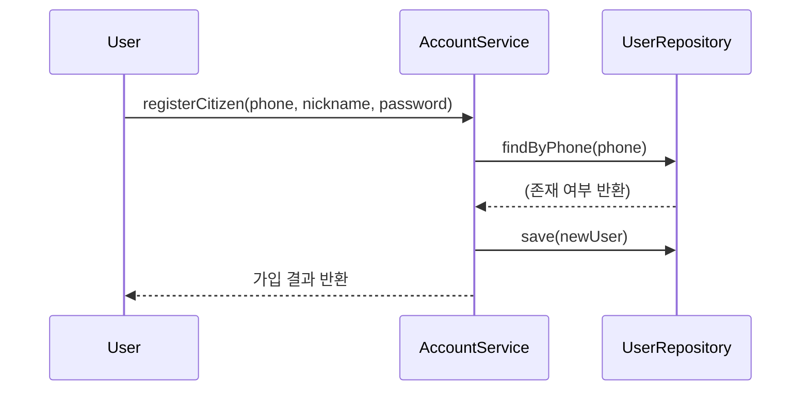

- [비즈니스 규칙] 휴대폰 중복 불가, 임시 계정 생성, 관리자 알림
- [예외] 이미 등록된 번호 → DuplicatePhoneException

### 3.2 Team

#### 주요 속성(필드)

| 필드명     | 타입     | 설명        | 비고                                                |
| ---------- | -------- | ----------- | --------------------------------------------------- |
| id         | bigint   | PK          | DB: team.id                                         |
| name       | varchar  | 팀명        | DB: team.name                                       |
| org_id     | bigint   | 소속 기관ID | DB: team.org_id                                     |
| leader_id  | bigint   | 팀장ID      | DB: team.leader_id                                  |
| status     | enum     | 상태        | DB: team.status, [team_status Enum](../3-1-Enum.md) |
| created_at | datetime | 생성일시    | DB: team.created_at                                 |

#### 주요 행위(메서드/시그니처) 및 비즈니스 규칙

- `addMember(teamId, userId): void`
  - [비즈니스 규칙] 팀장만 가능, 중복 불가, 팀원 수 제한(최대 20명)
  - [예외] 권한 없음 → UnauthorizedException, 이미 팀원 → DuplicateMemberException, 인원 초과 → TeamMemberLimitException
- `removeMember(teamId, userId): void`
  - [비즈니스 규칙] 팀장만 가능, 최소 1명 유지
  - [예외] 권한 없음 → UnauthorizedException, 팀원 미존재 → NotTeamMemberException, 최소 인원 미달 → TeamMemberMinException
- `assignLeader(teamId, userId): void`
  - [비즈니스 규칙] 팀원 중에서만 가능, 이력 기록
  - [예외] 팀원 아님 → NotTeamMemberException
- `calculatePerformance(teamId, period): PerformanceResult`
  - [비즈니스 규칙] 보고서별 기여도 자동 계산, 실적 분배 총합 100% 초과 불가
  - [예외] 분배 오류 → PerformanceDistributionException
- `disbandTeam(teamId, adminUserId): void`
  - [비즈니스 규칙] 관리자만 가능, 팀원 모두 알림
  - [예외] 권한 없음 → UnauthorizedException

#### 상태/라이프사이클 및 전이 조건

| 상태      | 전이 조건/행위   | Enum 참조   |
| --------- | ---------------- | ----------- |
| CREATED   | createTeam()     | team_status |
| ACTIVE    | addMember()      | team_status |
| INACTIVE  | deactivateTeam() | team_status |
| DISBANDED | disbandTeam()    | team_status |

#### 예외/엣지케이스

- 팀장 미지정, 실적 분배 오류, 팀원 미존재, 인원 초과, 중복 팀명, 권한 없음, 팀원 중복 추가 등

#### 도메인 서비스/리포지토리 시그니처

- TeamRepository
  - `findById(teamId): Team`
  - `save(team): void`
  - `findByName(name): Team`
- TeamService
  - `addMember(teamId, userId): void`
  - `removeMember(teamId, userId): void`
  - `assignLeader(teamId, userId): void`
  - `calculatePerformance(teamId, period): PerformanceResult`
  - `disbandTeam(teamId, adminUserId): void`

#### 유스케이스별 도메인 흐름 예시

##### UC_TEAM_01: 팀원 추가

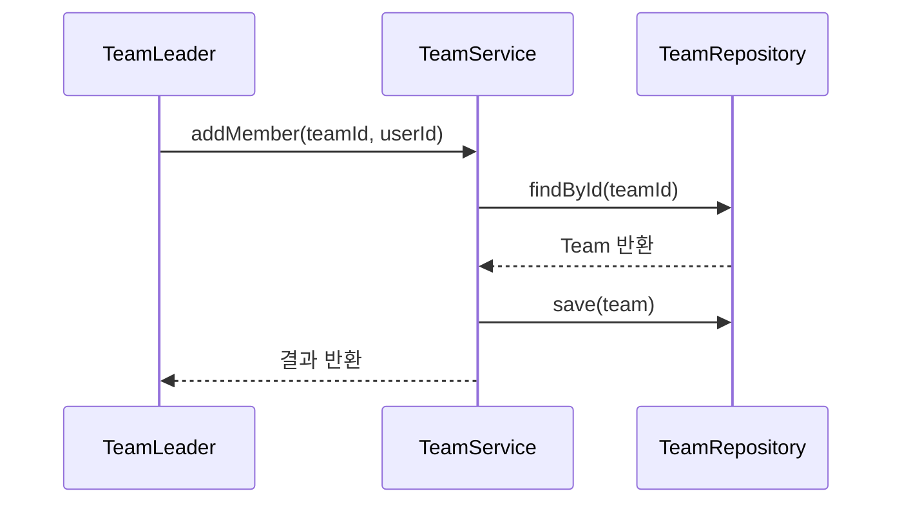

- [비즈니스 규칙] 팀장만 가능, 중복 불가, 팀원 수 제한(최대 20명)
- [예외] 권한 없음, 이미 팀원, 인원 초과

### 3.3 Report

#### 주요 속성(필드)

| 필드명           | 타입     | 설명        | 비고                                                            |
| ---------------- | -------- | ----------- | --------------------------------------------------------------- |
| id               | bigint   | PK          | DB: report.id                                                   |
| type             | enum     | 유형        | DB: report.type, [report_type Enum](../3-1-Enum.md)             |
| user_id          | bigint   | 작성자ID    | DB: report.user_id                                              |
| team_id          | bigint   | 팀ID        | DB: report.team_id                                              |
| status           | enum     | 상태        | DB: report.status, [report_status Enum](../3-1-Enum.md)         |
| beach_id         | bigint   | 해변ID      | DB: report.beach_id                                             |
| investigation_at | datetime | 조사일시    | DB: report.investigation_at                                     |
| content          | json     | 보고서 내용 | DB: report.content, [ReportContent 값 객체](#1-5-reportcontent) |
| created_at       | datetime | 생성일시    | DB: report.created_at                                           |

#### 주요 행위(메서드/시그니처) 및 비즈니스 규칙

- `createInvestigationReport(userId, beachId, data): Report`
  - [비즈니스 규칙] 승인된 사용자만 가능, 동일 해변/일자 중복 보고 불가
  - [예외] 미승인 사용자 → UnauthorizedException, 중복 보고 → DuplicateReportException
- `createCleaningReport(userId, beachId, data): Report`
  - [비즈니스 규칙] 승인된 사용자만 가능, 동일 해변/일자 중복 보고 불가
  - [예외] 미승인 사용자, 중복 보고
- `submitReport(reportId, userId): void`
  - [비즈니스 규칙] 작성자만 가능, 상태 변경(DRAFT→SUBMITTED)
  - [예외] 권한 없음 → UnauthorizedException, 이미 제출됨 → AlreadySubmittedException
- `approveReport(reportId, adminUserId): void`
  - [비즈니스 규칙] 관리자만 가능, 상태 변경(SUBMITTED→APPROVED)
  - [예외] 권한 없음, 잘못된 상태
- `rejectReport(reportId, adminUserId, reason): void`
  - [비즈니스 규칙] 관리자만 가능, 상태 변경(SUBMITTED→REJECTED), 사유 기록
  - [예외] 권한 없음, 잘못된 상태

#### 상태/라이프사이클 및 전이 조건

| 상태      | 전이 조건/행위  | Enum 참조     |
| --------- | --------------- | ------------- |
| DRAFT     | createReport()  | report_status |
| SUBMITTED | submitReport()  | report_status |
| APPROVED  | approveReport() | report_status |
| REJECTED  | rejectReport()  | report_status |

#### 예외/엣지케이스

- GPS 오류, 사진 실패, 중복 보고, 미승인 사용자, 잘못된 상태, 첨부자료 누락 등

#### 도메인 서비스/리포지토리 시그니처

- ReportRepository
  - `findById(reportId): Report`
  - `save(report): void`
  - `findByUserAndDate(userId, date): List<Report>`
- ReportService
  - `createInvestigationReport(userId, beachId, data): Report`
  - `createCleaningReport(userId, beachId, data): Report`
  - `submitReport(reportId, userId): void`
  - `approveReport(reportId, adminUserId): void`
  - `rejectReport(reportId, adminUserId, reason): void`

#### 유스케이스별 도메인 흐름 예시

##### UC_REPORT_01: 보고서 제출

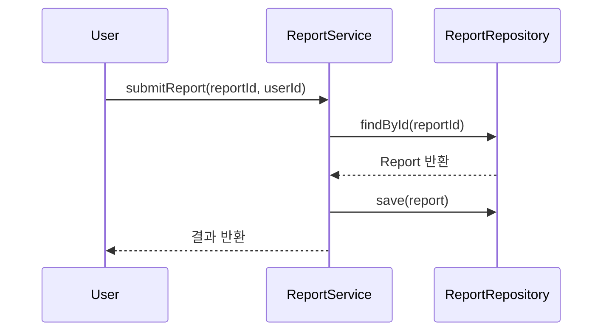

- [비즈니스 규칙] 작성자만 가능, 상태 변경(DRAFT→SUBMITTED)
- [예외] 권한 없음, 이미 제출됨

### 3.4 Depot

#### 주요 속성(필드)

| 필드명                       | 타입     | 설명             | 비고                                                  |
| ---------------------------- | -------- | ---------------- | ----------------------------------------------------- |
| id                           | bigint   | PK               | DB: depot.id                                          |
| collection_request_report_id | bigint   | 수거요청보고서ID | DB: depot.collection_request_report_id                |
| name                         | varchar  | 집하장명         | DB: depot.name                                        |
| address                      | varchar  | 주소             | DB: depot.address                                     |
| latitude                     | double   | 위도             | DB: depot.latitude                                    |
| longitude                    | double   | 경도             | DB: depot.longitude                                   |
| photo_url                    | varchar  | 사진 URL         | DB: depot.photo_url                                   |
| status                       | enum     | 상태             | DB: depot.status, [depot_status Enum](../3-1-Enum.md) |
| collector_id                 | bigint   | 수거자ID         | DB: depot.collector_id                                |
| collection_completed_at      | datetime | 수거완료일시     | DB: depot.collection_completed_at                     |
| collected_amount             | int      | 수거량           | DB: depot.collected_amount                            |
| note                         | varchar  | 비고             | DB: depot.note                                        |

#### 주요 행위(메서드/시그니처) 및 비즈니스 규칙

- `updateLocation(depotId, latitude, longitude): void`
  - [비즈니스 규칙] 위치 중복 불가, 위경도 유효성 검증
  - [예외] 위치 중복 → DuplicateLocationException, 잘못된 좌표 → InvalidLocationException
- `addImage(depotId, photo_url): void`
  - [비즈니스 규칙] 사진 필수, 이미지 용량/포맷 제한
  - [예외] 사진 누락 → ImageRequiredException, 포맷 오류 → InvalidImageFormatException
- `markAsCollected(depotId, userId, amount): void`
  - [비즈니스 규칙] 수거자만 가능, 상태 변경, 수거량 0 이상
  - [예외] 권한 없음 → UnauthorizedException, 수거량 오류 → InvalidAmountException
- `reportProblem(depotId, note): void`
  - [비즈니스 규칙] 문제 발생 시 관리자 알림, 상세 사유 기록
  - [예외] 사유 누락 → NoteRequiredException

#### 상태/라이프사이클 및 전이 조건

| 상태       | 전이 조건/행위    | Enum 참조    |
| ---------- | ----------------- | ------------ |
| REGISTERED | createDepot()     | depot_status |
| WAITING    | updateLocation()  | depot_status |
| COLLECTED  | markAsCollected() | depot_status |
| PROBLEM    | reportProblem()   | depot_status |

#### 예외/엣지케이스

- 위치 중복, 사진 누락, 수거 미완료, 잘못된 좌표, 수거량 오류, 권한 없음 등

#### 도메인 서비스/리포지토리 시그니처

- DepotRepository
  - `findById(depotId): Depot`
  - `save(depot): void`
- DepotService
  - `updateLocation(depotId, latitude, longitude): void`
  - `addImage(depotId, photo_url): void`
  - `markAsCollected(depotId, userId, amount): void`
  - `reportProblem(depotId, note): void`

#### 유스케이스별 도메인 흐름 예시

##### UC_DEPOT_01: 집하장 위치 업데이트

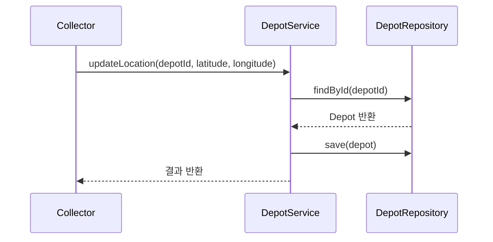

- [비즈니스 규칙] 위치 중복 불가, 위경도 유효성 검증
- [예외] 위치 중복, 잘못된 좌표

### 3.5 Notification

#### 주요 속성(필드)

| 필드명     | 타입     | 설명     | 비고                                                                |
| ---------- | -------- | -------- | ------------------------------------------------------------------- |
| id         | bigint   | PK       | DB: notification.id                                                 |
| user_id    | bigint   | 수신자ID | DB: notification.user_id                                            |
| type       | enum     | 유형     | DB: notification.type, [notification_type Enum](../3-1-Enum.md)     |
| title      | varchar  | 제목     | DB: notification.title                                              |
| message    | varchar  | 메시지   | DB: notification.message                                            |
| status     | enum     | 상태     | DB: notification.status, [notification_status Enum](../3-1-Enum.md) |
| created_at | datetime | 생성일시 | DB: notification.created_at                                         |

#### 주요 행위(메서드/시그니처) 및 비즈니스 규칙

- `send(notificationId): void`
  - [비즈니스 규칙] 중복 발송 방지, 발송 이력 기록
  - [예외] 이미 발송됨 → AlreadySentException, 발송 실패 → NotificationSendException
- `markAsRead(notificationId): void`
  - [비즈니스 규칙] 수신자만 가능, 상태 변경(SENT→READ)
  - [예외] 권한 없음 → UnauthorizedException, 잘못된 상태 → InvalidStatusException
- `updatePreferences(userId, preferences): void`
  - [비즈니스 규칙] 구독/알림 설정 변경, 유효성 검증
  - [예외] 잘못된 설정 → InvalidPreferenceException

#### 상태/라이프사이클 및 전이 조건

| 상태    | 전이 조건/행위       | Enum 참조           |
| ------- | -------------------- | ------------------- |
| CREATED | createNotification() | notification_status |
| SENT    | send()               | notification_status |
| READ    | markAsRead()         | notification_status |
| FAILED  | send() 실패          | notification_status |

#### 예외/엣지케이스

- 알림 미수신, 중복 발송, 실패 처리, 권한 없음, 잘못된 상태, 설정 오류 등

#### 도메인 서비스/리포지토리 시그니처

- NotificationRepository
  - `findById(notificationId): Notification`
  - `save(notification): void`
- NotificationService
  - `send(notificationId): void`
  - `markAsRead(notificationId): void`
  - `updatePreferences(userId, preferences): void`

#### 유스케이스별 도메인 흐름 예시

##### UC_NOTIFICATION_01: 알림 발송

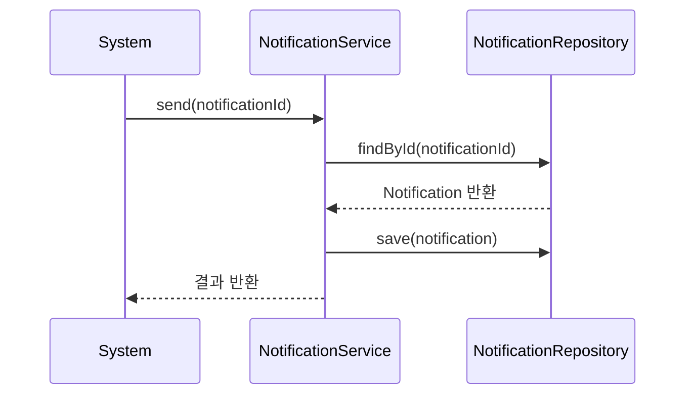

- [비즈니스 규칙] 중복 발송 방지, 발송 이력 기록
- [예외] 이미 발송됨, 발송 실패

### 3.6 Organization

#### 주요 속성(필드)

| 필드명    | 타입    | 설명        | 비고                                                                |
| --------- | ------- | ----------- | ------------------------------------------------------------------- |
| id        | bigint  | PK          | DB: organization.id                                                 |
| name      | varchar | 기관명      | DB: organization.name                                               |
| type      | enum    | 유형        | DB: organization.type, [organization_type Enum](../3-1-Enum.md)     |
| parent_id | bigint  | 상위 기관ID | DB: organization.parent_id                                          |
| status    | enum    | 상태        | DB: organization.status, [organization_status Enum](../3-1-Enum.md) |

#### 주요 행위(메서드/시그니처) 및 비즈니스 규칙

- `addUser(orgId, userId): void`
  - [비즈니스 규칙] 중복 불가, 권한 체크
- `removeUser(orgId, userId): void`
  - [비즈니스 규칙] 최소 1명 유지
- `updateInfo(orgId, info): void`
  - [비즈니스 규칙] 관리자만 가능

#### 상태/라이프사이클 및 전이 조건

| 상태     | 전이 조건/행위 | Enum 참조           |
| -------- | -------------- | ------------------- |
| ACTIVE   | addUser()      | organization_status |
| INACTIVE | removeUser()   | organization_status |

#### 예외/엣지케이스

- 중복 소속, 권한 없음, 최소 인원 미달 등

#### 도메인 서비스/리포지토리 시그니처

- OrganizationRepository
  - `findById(orgId): Organization`
  - `save(organization): void`
- OrganizationService
  - `addUser(orgId, userId): void`
  - `removeUser(orgId, userId): void`
  - `updateInfo(orgId, info): void`

#### 유스케이스별 도메인 흐름 예시

##### UC_ORG_01: 기관 사용자 추가

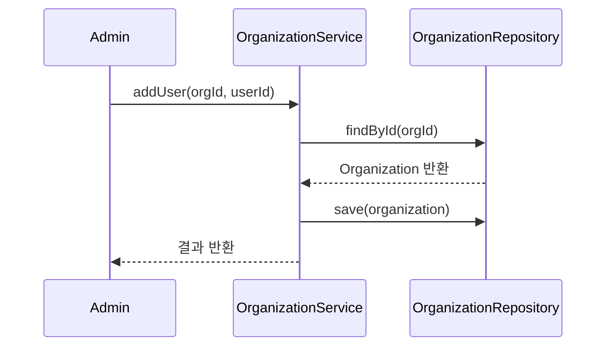

### 3.7 Beach

#### 주요 속성(필드)

| 필드명    | 타입    | 설명   | 비고                                                  |
| --------- | ------- | ------ | ----------------------------------------------------- |
| id        | bigint  | PK     | DB: beach.id                                          |
| name      | varchar | 해변명 | DB: beach.name                                        |
| address   | varchar | 주소   | DB: beach.address                                     |
| latitude  | double  | 위도   | DB: beach.latitude                                    |
| longitude | double  | 경도   | DB: beach.longitude                                   |
| status    | enum    | 상태   | DB: beach.status, [beach_status Enum](../3-1-Enum.md) |

#### 주요 행위(메서드/시그니처) 및 비즈니스 규칙

- `updateInfo(beachId, info): void`
  - [비즈니스 규칙] 관리자만 가능
- `addArea(beachId, areaData): void`
  - [비즈니스 규칙] 중복 구역 불가

#### 상태/라이프사이클 및 전이 조건

| 상태     | 전이 조건/행위 | Enum 참조    |
| -------- | -------------- | ------------ |
| ACTIVE   | updateInfo()   | beach_status |
| INACTIVE | 비활성화       | beach_status |

#### 예외/엣지케이스

- 중복 구역, 권한 없음 등

#### 도메인 서비스/리포지토리 시그니처

- BeachRepository
  - `findById(beachId): Beach`
  - `save(beach): void`
- BeachService
  - `updateInfo(beachId, info): void`
  - `addArea(beachId, areaData): void`

#### 유스케이스별 도메인 흐름 예시

##### UC_BEACH_01: 해변 정보 수정

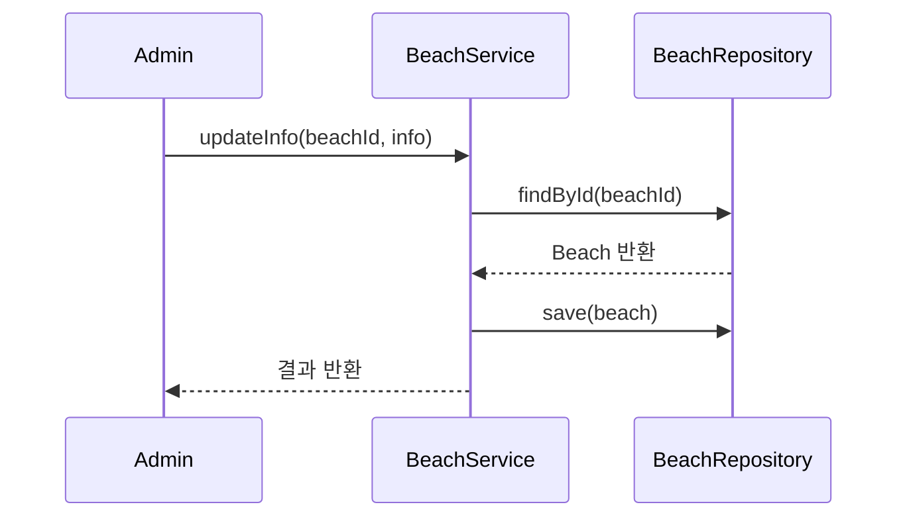

### 3.8 ReportArea

#### 주요 속성(필드)

| 필드명      | 타입   | 설명     | 비고                                                              |
| ----------- | ------ | -------- | ----------------------------------------------------------------- |
| id          | bigint | PK       | DB: report_area.id                                                |
| report_id   | bigint | 보고서ID | DB: report_area.report_id                                         |
| area_type   | enum   | 구역유형 | DB: report_area.area_type, [area_type Enum](../3-1-Enum.md)       |
| coordinates | string | 좌표     | DB: report_area.coordinates                                       |
| status      | enum   | 상태     | DB: report_area.status, [report_area_status Enum](../3-1-Enum.md) |

#### 주요 행위(메서드/시그니처) 및 비즈니스 규칙

- `updateArea(reportAreaId, data): void`
  - [비즈니스 규칙] 담당자만 가능
- `assignWorker(reportAreaId, userId): void`
  - [비즈니스 규칙] 관리자만 가능

#### 상태/라이프사이클 및 전이 조건

| 상태     | 전이 조건/행위 | Enum 참조          |
| -------- | -------------- | ------------------ |
| ASSIGNED | assignWorker() | report_area_status |
| UPDATED  | updateArea()   | report_area_status |

#### 예외/엣지케이스

- 담당자 미지정, 좌표 오류 등

#### 도메인 서비스/리포지토리 시그니처

- ReportAreaRepository
  - `findById(reportAreaId): ReportArea`
  - `save(reportArea): void`
- ReportAreaService
  - `updateArea(reportAreaId, data): void`
  - `assignWorker(reportAreaId, userId): void`

#### 유스케이스별 도메인 흐름 예시

##### UC_REPORTAREA_01: 구역 담당자 배정

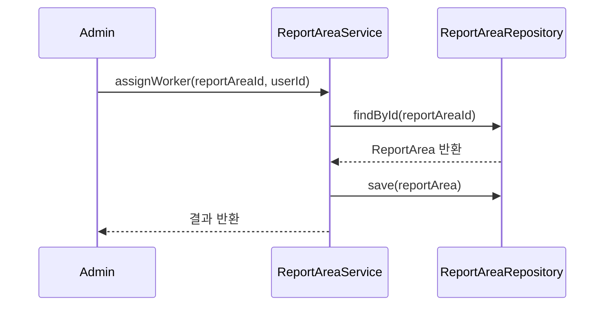

### 3.9 Image

#### 주요 속성(필드)

| 필드명     | 타입     | 설명       | 비고                                                          |
| ---------- | -------- | ---------- | ------------------------------------------------------------- |
| id         | bigint   | PK         | DB: image.id                                                  |
| url        | varchar  | 이미지 URL | DB: image.url                                                 |
| owner_type | enum     | 소유자유형 | DB: image.owner_type, [image_owner_type Enum](../3-1-Enum.md) |
| owner_id   | bigint   | 소유자ID   | DB: image.owner_id                                            |
| created_at | datetime | 생성일시   | DB: image.created_at                                          |

#### 주요 행위(메서드/시그니처) 및 비즈니스 규칙

- `attachToReport(imageId, reportId): void`
  - [비즈니스 규칙] 보고서/집하장에만 첨부 가능
- `attachToDepot(imageId, depotId): void`
  - [비즈니스 규칙] 보고서/집하장에만 첨부 가능

#### 예외/엣지케이스

- 잘못된 소유자 유형, 중복 첨부 등

#### 도메인 서비스/리포지토리 시그니처

- ImageRepository
  - `findById(imageId): Image`
  - `save(image): void`
- ImageService
  - `attachToReport(imageId, reportId): void`
  - `attachToDepot(imageId, depotId): void`

#### 유스케이스별 도메인 흐름 예시

##### UC_IMAGE_01: 이미지 첨부

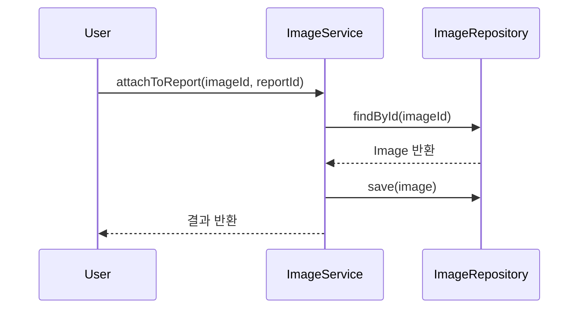

- [비즈니스 규칙] 보고서/집하장에만 첨부 가능
- [예외] 잘못된 소유자 유형, 중복 첨부

## 4. 도메인 계층 구조(DDD)

- **엔티티(Entity):**
  - User, Team, Report, Depot, Notification, Organization, Beach, ReportArea, Image 등 (식별자/상태 명확히)
- **밸류 객체(Value Object):**
  - Location(위경도), Status(Enum), Role(Enum), Address, DateTimeRange, ReportContent 등 (불변성/동등성)
- **도메인 서비스(Domain Service):**
  - PerformanceService(실적정산), TeamService(팀관리), NotificationService(알림발송), AccountService(계정생성/인증), ReportService(보고서 제출/승인), AssignmentService(작업배정), ClaimService(중복보고방지) 등 (책임/주요 메서드/규칙 명확히)
- **리포지토리(Repository):**
  - UserRepository, TeamRepository, ReportRepository, CollectionDepotRepository 등 (CRUD/조회 메서드 시그니처)

## 5. 유스케이스별 도메인 흐름(상세)

### 5.1 팀 실적 정산

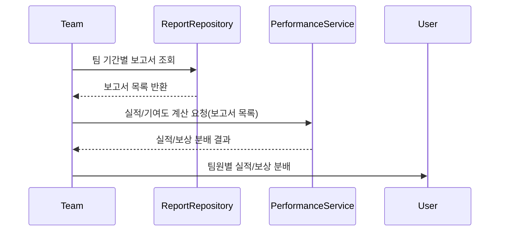

- **비즈니스 규칙:**
  - 팀장은 실적 분배 비율을 설정할 수 있다.
  - 실적 분배는 보고서별 기여도에 따라 자동 계산된다.
  - 분배 결과에 이의제기 가능(이의제기 시 상태 변경)

### 5.2 오프라인 동기화

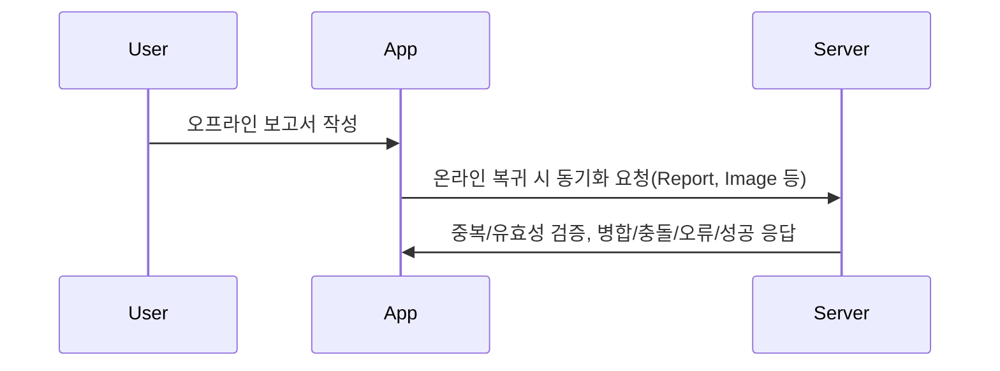

- **비즈니스 규칙:**
  - 동기화 시 중복 보고/Claim, 첨부자료 누락, 상태 불일치 등 검증
  - 충돌 발생 시 사용자/관리자에게 알림 및 수동 조정 가능

### 5.3 (주요 유스케이스별 상세 흐름 추가)

- UC_WORKER_01~04, UC_CITIZEN_01, UC_ADMIN_01 등 유스케이스 명세서와 1:1 매핑하여, 관련 도메인 객체/서비스/값 객체/외부 시스템의 상호작용을 Mermaid 다이어그램+단계별 규칙/예외로 상세화

## 6. 비즈니스 규칙(공통/전역)

- **역할별 권한/정책:**
  - 정책 문서(README) 및 1-1 프로젝트 개요 참조
- **승인/정산/알림 정책:**
  - 각 객체별 상세 규칙 외, 전역 정책은 별도 표/리스트로 정리
- **상태/라이프사이클/예외/엣지케이스:**
  - 실제 운영 중 발생 가능한 모든 경계상황 포함

## 7. 실무적 작성 팁 및 함정/엣지케이스

- DB 설계서/유스케이스 명세서와 반드시 1:1 매핑(속성/상태/관계/ID/정책 등 불일치 시 혼란 발생)
- 비즈니스 규칙은 "누가/언제/어떻게/예외"까지 명확히(예: "팀장은 팀원 실적 분배 비율을 0~100% 내에서 조정할 수 있다. 단, 분배 총합은 100%를 초과할 수 없다.")
- 상태/라이프사이클/예외/엣지케이스는 반드시 명시(실제 운영 중 발생 가능한 모든 경계상황 포함)
- Mermaid 등 다이어그램은 실제 업무 흐름/정책/예외를 반영(단순 요약이 아니라, 실제 구현/운영에 필요한 상세 흐름)
- 정책/비즈니스 로직 변경 시 영향도 추적 용이하도록 문서 내 참조/링크/매핑표 적극 활용

## 8. 변경 이력

| 버전 | 일자       | 작성자 | 변경 내용                              |
| ---- | ---------- | ------ | -------------------------------------- |
| v2   | 2024-06-XX | 홍길동 | 실무적 도메인 모델 상세화 및 전면 개정 |
| v1   | 2024-06-XX | 홍길동 | 최초 작성                              |
