# 2-5 시퀀스/상태/활동 다이어그램

## 1. 목적 및 범위

- 본 문서는 Beach-Saver의 주요 유스케이스/기능별 동적 상호작용, 예외/경계/알림/상태 변화를 시각적으로 명확히 전달한다.
- Mermaid 등으로 시퀀스/상태/활동 다이어그램을 작성, 개발/운영팀이 바로 참조할 수 있도록 한다.
- 각 다이어그램은 관련 유스케이스(UC_XXX) 또는 기능 요구사항(FR-XX)과의 연계를 명확히 표기한다.
- **참여자(API) 정의:** 본 문서의 'API'는 백엔드 API 서버의 대표 인터페이스를 의미하며, 내부 도메인 서비스(예: ReportService, TeamService 등)는 필요시 별도 다이어그램 또는 도메인 모델 문서에서 상세화한다.

## 2. 주요 시나리오별 시퀀스 다이어그램

> **실무 가이드:**
>
> - 각 다이어그램 상단에 관점, 관련 유스케이스/FR, 주요 예외 흐름, 실무적 활용 포인트를 명시.
> - alt/opt 블록을 적극 활용해 예외·분기 흐름을 구체적으로 표현.

### 2.1 관리자 통계 생성/조회

- **관점:** 시스템 컴포넌트
- **관련 유스케이스:** UC_ADMIN_02, FR-11
- **API 정의:** API=백엔드 API 서버
- **활용:** 통계 조회 시 정상/오류/권한 예외 흐름까지 명확히 파악 가능

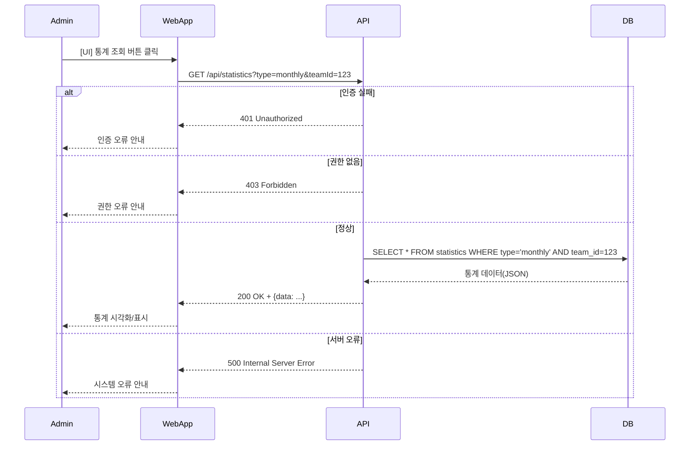

### 2.2 오프라인 동기화 충돌 처리

- **관점:** 시스템 컴포넌트
- **관련 유스케이스:** UC_WORKER_03, FR-21
- **API 정의:** API=백엔드 API 서버
- **활용:** 동기화 시 충돌/오류/성공 분기 및 사용자 선택 흐름까지 상세히 파악 가능

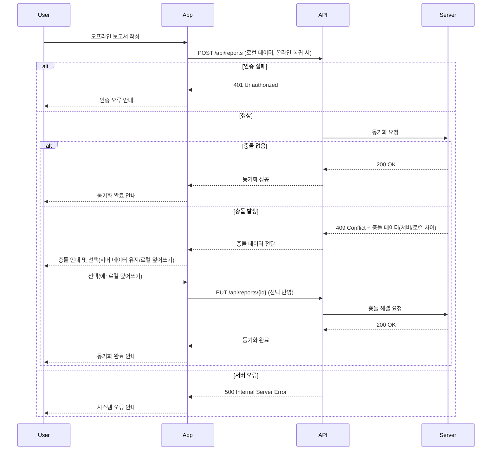

### 2.3 팀 실적 정산

- **관점:** 시스템 컴포넌트
- **관련 유스케이스:** UC_ADMIN_03, FR-15
- **API 정의:** API=백엔드 API 서버
- **활용:** 실적 정산 요청~결과 반환, 데이터 오류/권한 예외 흐름까지 포함

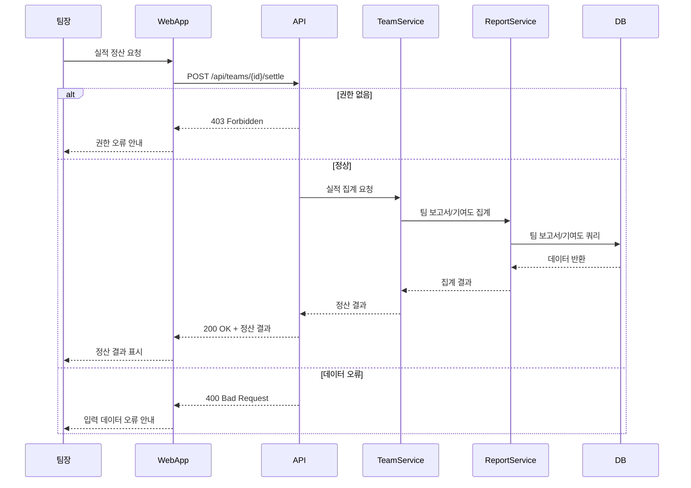

### 2.4 AI 예측 결과 반영

- **관점:** 시스템 컴포넌트
- **관련 유스케이스:** UC_ADMIN_04, FR-18
- **API 정의:** API=백엔드 API 서버
- **활용:** 예측 요청~결과 반환, 입력 오류/서버 오류 예외 흐름 포함

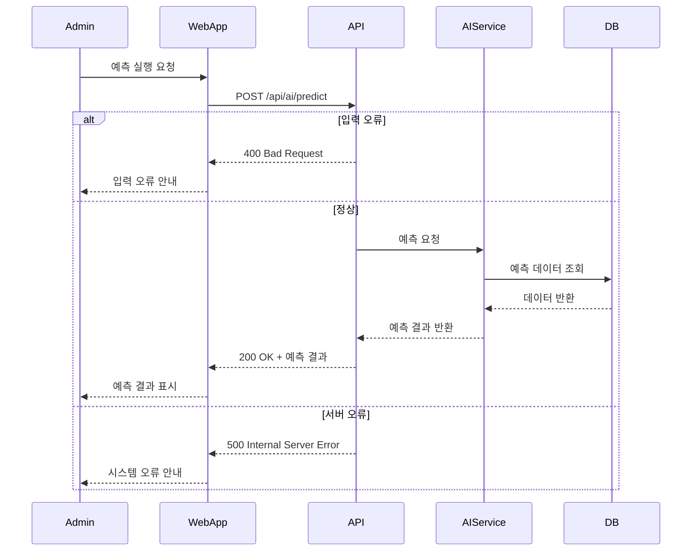

### 2.5 현장 보고서 제출 및 승인 프로세스

- **관점:** 시스템 컴포넌트
- **관련 유스케이스:** UC_WORKER_01, UC_ADMIN_01, FR-10
- **API 정의:** API=백엔드 API 서버
- **활용:** 보고서 제출~승인, 승인 거절/알림 등 예외 흐름 포함

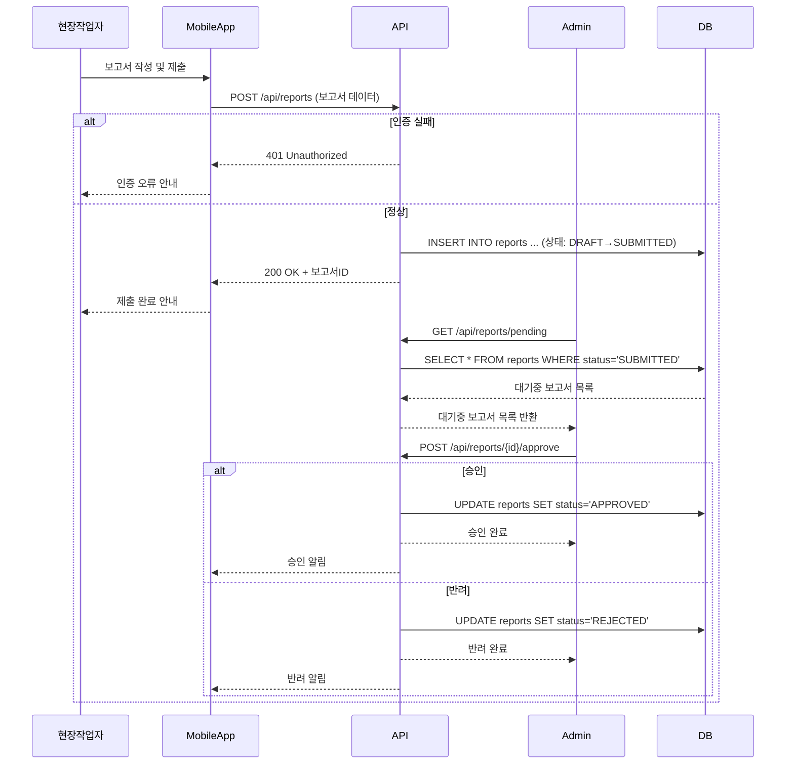

## 3. 상태/활동 다이어그램 예시

> **실무 가이드:**
>
> - 각 상태 다이어그램에 상태, 트리거, 전이 조건/액션/가드 조건을 명시.
> - 복잡한 상태 변화는 [조건]/액션 표기법으로 가드 및 액션을 표현.

### 3.1 보고서 상태 변화 (report_status Enum)

- **관련 엔티티:** Report
- **상태:** DRAFT, SUBMITTED, APPROVED, REJECTED
- **트리거:** createReport(), submitReport(), approveReport(), rejectReport()
- **예시 액션:** 승인 시 알림 발송, 반려 시 사유 기록

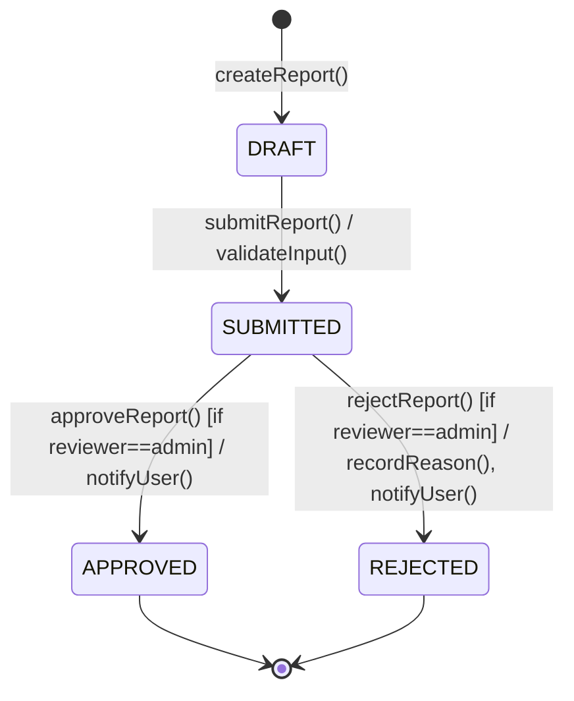

### 3.2 사용자(User) 상태 변화

- **관련 엔티티:** User
- **상태:** REGISTERED, PENDING_APPROVAL, ACTIVE, SUSPENDED, WITHDRAWN
- **트리거:** register(), approveUser(), suspendUser(), withdrawUser()
- **예시 액션:** 승인 시 환영 메일 발송, 정지 시 알림

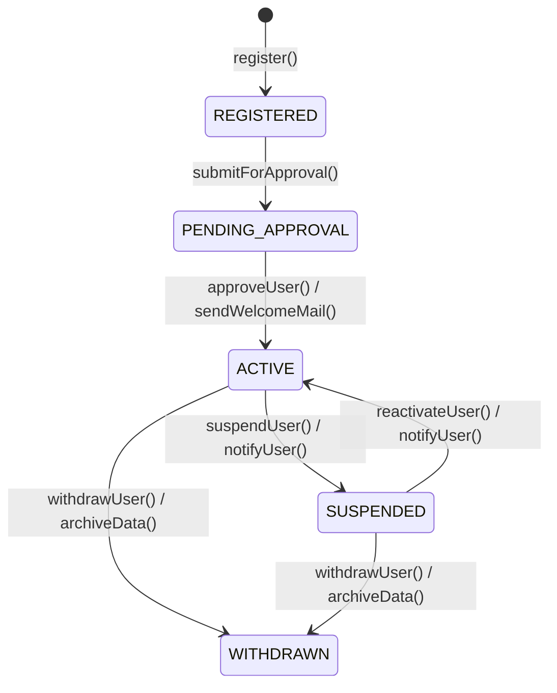

### 3.3 팀(Team) 상태 변화

- **관련 엔티티:** Team
- **상태:** CREATED, ACTIVE, DISBANDED
- **트리거:** createTeam(), activateTeam(), disbandTeam()
- **예시 액션:** 해체 시 팀원 알림

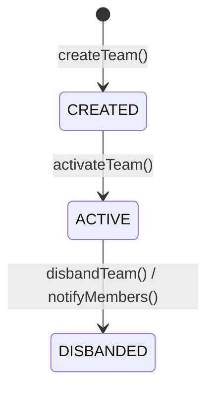

### 3.4 수거거점(CollectionDepot) 상태 변화

- **관련 엔티티:** CollectionDepot
- **상태:** WAITING, COLLECTED, ISSUE
- **트리거:** markWaiting(), markCollected(), reportIssue(), resolveIssue()
- **예시 액션:** 이슈 발생 시 관리자 알림

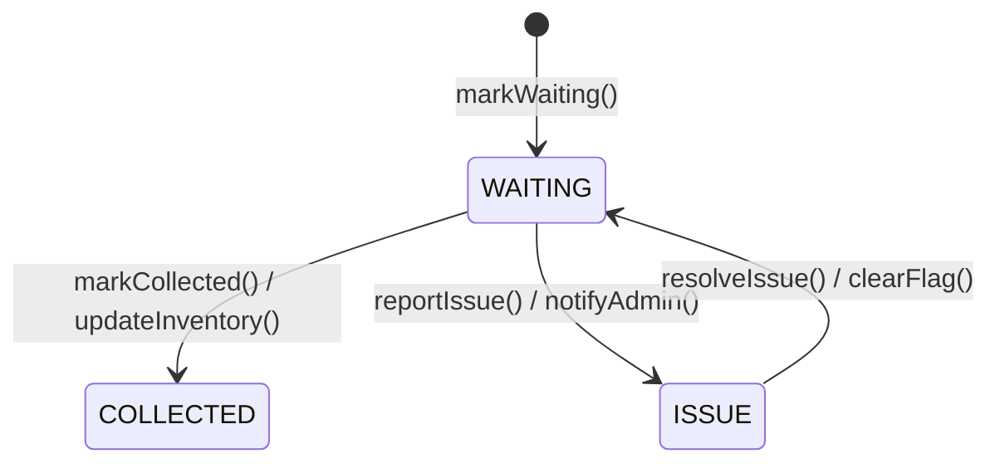

### 3.5 전체 업무 흐름(Activity Diagram) - 조사자→청소자→수거자

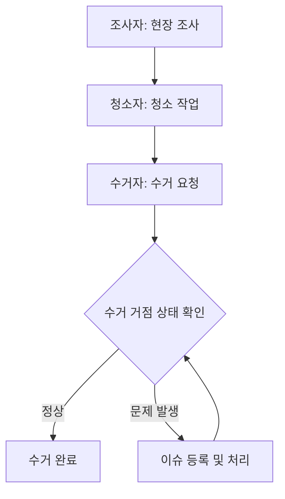

### 3.6 시민 가입~활동 전체 여정(Activity Diagram)

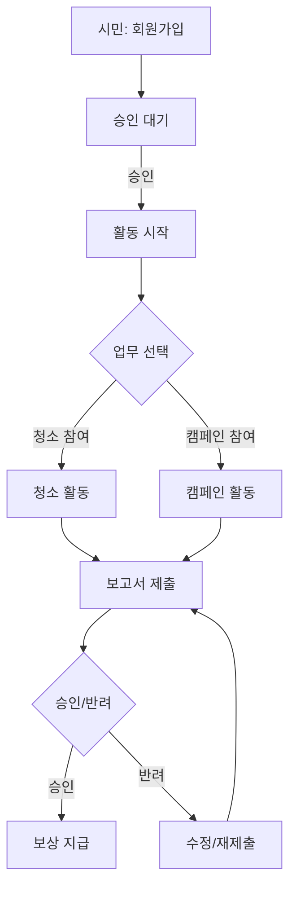

## 4. 변경 이력

| 버전 | 일자       | 작성자 | 변경 내용                                                      |
| ---- | ---------- | ------ | -------------------------------------------------------------- |
| v1   | 2024-06-XX | 홍길동 | 최초 작성                                                      |
| v2   | 2024-06-XX | AI     | 실무적 피드백 반영, 다이어그램 상세화/확장                     |
| v3   | 2024-06-XX | AI     | API 정의, 예외 흐름/가드/액션/활동 다이어그램/실무 가이드 추가 |
